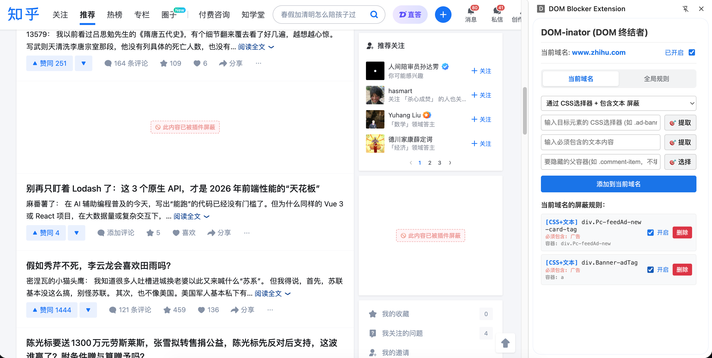

# DOM-inator 🤖

[中文版](./README.md)

## 📌 Introduction

> 🤖 **Special Note**: All code and documentation for this project were entirely generated by AI!
> 💡 **Naming Easter Egg**: The geeky name `DOM-inator` was personally selected by the AI assistant, and the author fully respected and adopted the AI's taste and suggestion!

**💡 Original Intention**: When browsing forums or communities (like Juejin), there are always some annoying users or posts appearing frequently. Out of sight, out of mind. We needed a tool that could flexibly block specific text, and even hide the entire parent card along with it. Thus, this exclusive "self-defense" extension was born.

This is a lightweight, powerful, and visual Chrome browser element-blocking extension. It helps you customize and block unwanted content on web pages (such as ads, recommendation feeds, specific user comments, etc.), providing you with a much cleaner and purer browsing experience.

Unlike traditional ad-blocking extensions, this project focuses on providing an **intuitive visual selector** and **flexible custom blocking rules** (CSS selectors, specific text, image URLs), and hides elements in a non-destructive way (displaying a placeholder "🚫 This content has been blocked by the extension"), making it easy for users to know what has been blocked at any time.

## 🖼️ Preview

## ✨ Core Features

*   **Persistent Side Panel**: Clicking the extension icon opens a control panel on the right side of the browser, allowing you to operate while viewing the web page without interrupting your browsing flow.
*   **Global & Domain-Level Rule Isolation**: Supports configuring rules that only apply to the current domain, or global rules that apply to all websites, with easy switching.
*   **Visual "Picker" with Real-time Preview**: No coding knowledge required! Click the "🎯 Extract/Select" button, and when you hover the mouse over a web element, a floating preview of the extracted features (Text/CSS/Image URL) will be displayed nearby in real-time. Click to automatically generate a rule.
*   **Four Major Blocking Modes**:
    1.  **Specific Text Blocking**: Extract a piece of text from the webpage (e.g., a troll's username), and optionally block the "entire comment box" where this text is located.
    2.  **CSS Selector Blocking**: Precisely target and block webpage structures (smart optimization algorithm, one-click blocking of all similar elements).
    3.  **CSS Selector + Text Double Filtering**: Precision strike! First, use CSS to frame a batch of elements (like a list of comments), and then apply secondary filtering via "Must contain text" to block only the specific item containing the keyword.
    4.  **Specific Image Blocking**: Click to extract the ad image link and directly remove the ad image or the entire ad slot (perfectly supports intelligent feature extraction of SVG images).
*   **Independent Toggle for Each Rule**: In the rule list, you can toggle a switch at any time to enable or pause a specific blocking rule, and the change takes effect immediately.
*   **Global One-Click Pause**: A master switch is located at the top. If you need to view the original webpage, you can pause all blockings with one click.
*   **Smart State Memory**: Even if you close the side panel, the rules you half-entered and the extracted content will be automatically saved, and they will still be there the next time you open it.

---

## 🚀 Installation Guide (Developer Mode)

Since this extension is not yet available on the Chrome Web Store, you need to load it manually via "Developer Mode". The whole process is very simple and takes only 1 minute.

### Step 1: Get the extension files
Make sure you have the `basic-extension` folder, which contains `manifest.json` and other files.

### Step 2: Open the Chrome Extensions Management Page
1. Open your Google Chrome browser.
2. Type `chrome://extensions/` in the address bar and press Enter.
3. (Or click the three dots `⋮` in the upper right corner of the browser -> select **Extensions** -> **Manage Extensions**).

### Step 3: Enable "Developer Mode"
In the **upper right corner** of the extension management page, find the **Developer mode** switch and click to turn it on (the switch will turn blue).

### Step 4: Load the extension
1. After enabling Developer Mode, three new buttons will appear in the upper left corner of the page.
2. Click the leftmost button **"Load unpacked"**.
3. In the pop-up file selection window, find and select the `basic-extension` folder you just prepared, then click "Select/OK".

### Step 5: Pin the extension (Recommended)
1. After loading successfully, you will see the **DOM-inator** card on the page.
2. Click the "puzzle" icon (Extensions button) in the upper right corner of the browser.
3. Find **DOM-inator**, click the **"pin" icon** next to it to pin it to the browser's toolbar for easy access.

---

## 💡 Usage Guide

1. **Open the webpage you want to clean up**.
2. Click the recently pinned **DOM-inator** extension icon in the upper right corner of the browser, and the control panel will pop up on the right side.
3. Select whether you are configuring for the **Current Domain** or **Global Rules** at the top.
4. According to your needs, select the blocking type in the drop-down menu (Text / CSS / CSS+Text Double Filtering / Image).
5. Click the **"🎯 Extract"** or **"🎯 Select"** button on the panel.
6. Move the mouse into the webpage on the left. You will see a semi-transparent black mask. Moving the mouse will not only highlight the corresponding element, but also **display a floating preview of the extracted features next to the mouse**.
7. Click the element you want to block, and its feature information will be immediately filled back into the input box on the right panel.
8. Click **"Add to Current Domain"** or **"Add to Global Rules"** in the panel. A success prompt will appear at the bottom, and the list will automatically scroll to the bottom.
9. The element will be hidden instantly and display "🚫 This content has been blocked by the extension".
10. You can independently enable/pause the rule via the switch in the list below.

*(If you want to update the code: After modifying the code in the code editor, return to the `chrome://extensions/` page, click the **"Refresh" (🔄)** icon in the lower right corner of the extension card, and then refresh the webpage you want to test for it to take effect.)*